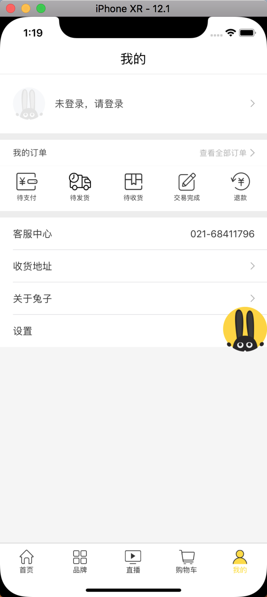

# TZTV-iOS
个人iOS项目

自从做了Java就没写过iOS了，趁最近有空把以前做的项目再拿出来重构一下。

## 重构计划

- 用YJRouter来统一管理页面的跳转。
- 重新封装网络请求。
- 用pod加载本地私有库，抽取公共基础代码。
- 采用Java编写后台服务。

## [Vue.js写的网页版,github地址](https://github.com/qq756585379/tzshop)
微信扫描下面二维码查看效果

## 效果图

## 捐赠

